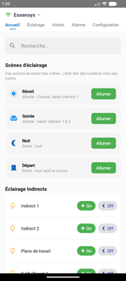
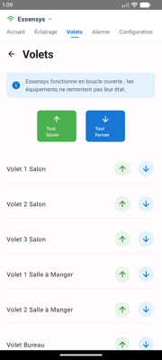
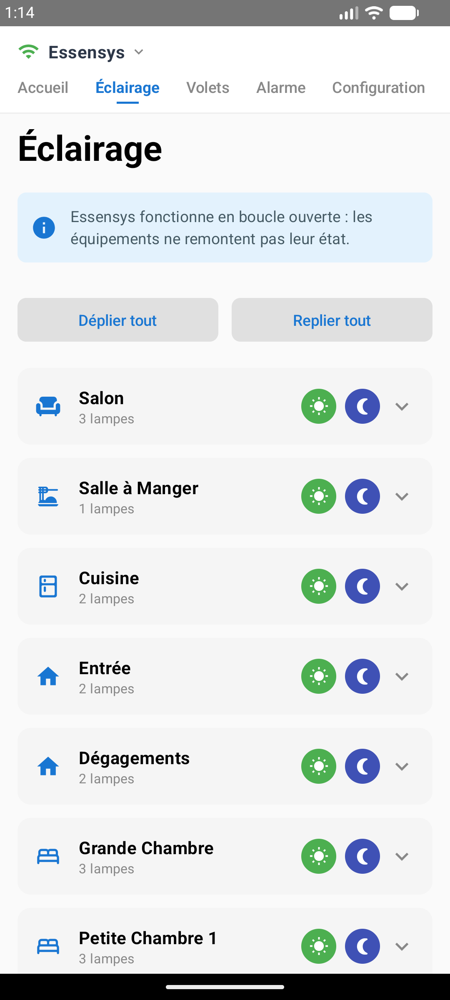
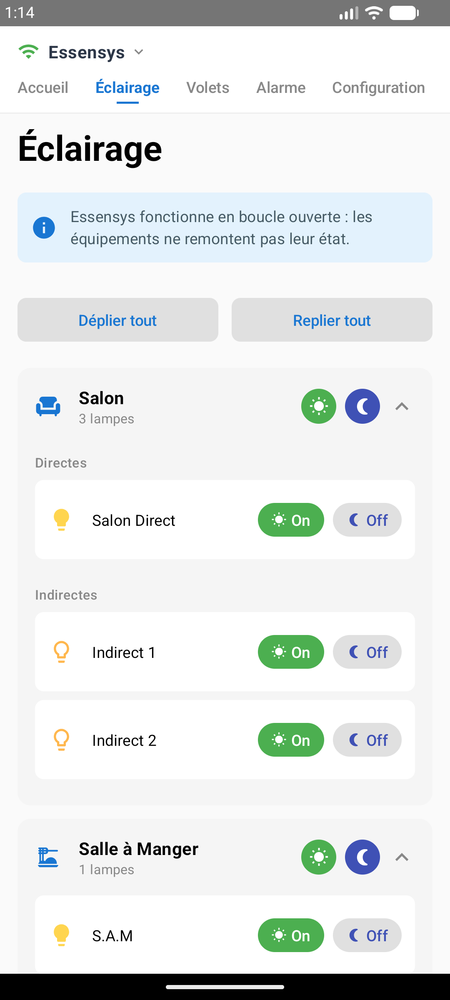
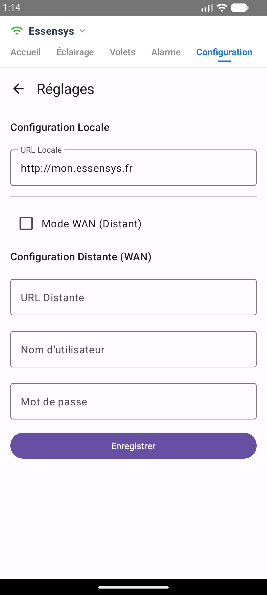

# Essensys Android App

L'application Android officielle pour le système domotique Essensys.

Cette application permet de contrôler votre installation Essensys (lumières, volets, scénarios) depuis votre smartphone Android, en local ou à distance.

## Téléchargement

Vous pouvez télécharger la dernière version de l'application (APK) directement ici :

[](https://github.com/essensys-hub/essensys-android-phone-apps/raw/refs/heads/main/mon.essensys.v.1.0.0.apk)

## Fonctionnalités

*   **Contrôle de l'éclairage** : Gestion pièce par pièce avec possibilité de tout allumer/éteindre ou déplier les détails.
*   **Volets roulants** : Ouverture et fermeture centralisée ou individuelle.
*   **Scénarios** : Activation rapide de scènes (Départ, Arrivée, Nuit, etc.).
*   **Mode double connexion** :
    *   **Local** : Connexion directe via le réseau Wi-Fi (par défaut `http://mon.essensys.fr`).
    *   **WAN** : Connexion à distance sécurisée avec authentification.
*   **Alarme** : Visualisation et contrôle (en cours de développement).

## Aperçu

### Accueil
Accès rapide aux scénarios, à l'état du chauffage et au résumé de la configuration.


### Éclairage
Contrôle complet de vos lumières, groupées par pièces pour une meilleure lisibilité.



### Volets
Gestion simple et efficace de tous vos ouvrants.


### Configuration et Réglages
Paramétrez facilement vos adresses de connexion locale et distante.


## Installation

1.  Téléchargez le fichier APK depuis le lien ci-dessus.
2.  Autorisez l'installation d'applications provenant de sources inconnues (si demandé par votre téléphone).
3.  Installez l'application.
4.  Lancez "Mon Essensys" et configurez vos URLs dans l'onglet "Configuration".

## Développement

Ce projet est développé en **Kotlin** avec **Jetpack Compose**.

### Prérequis
*   Android Studio Ladybug ou plus récent.
*   JDK 17.

### Compilation
```bash
./gradlew assembleDebug
```