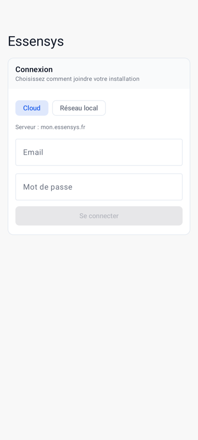
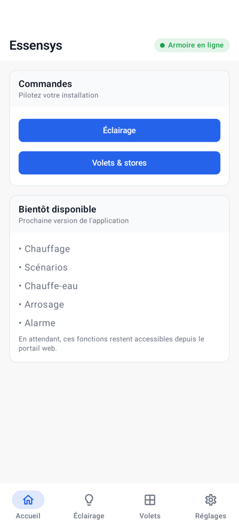
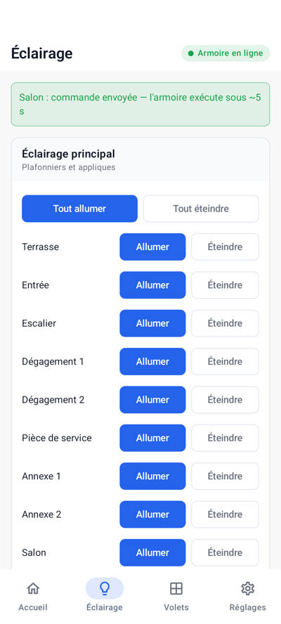
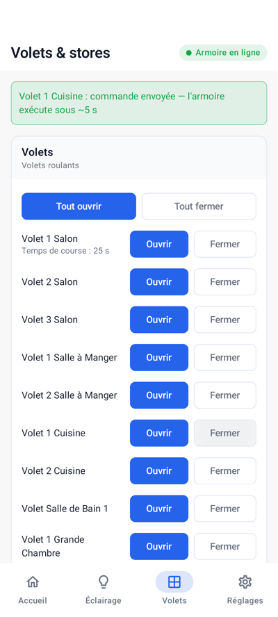
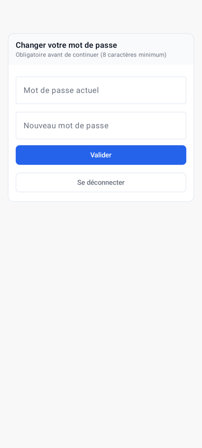
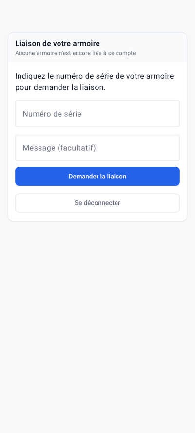
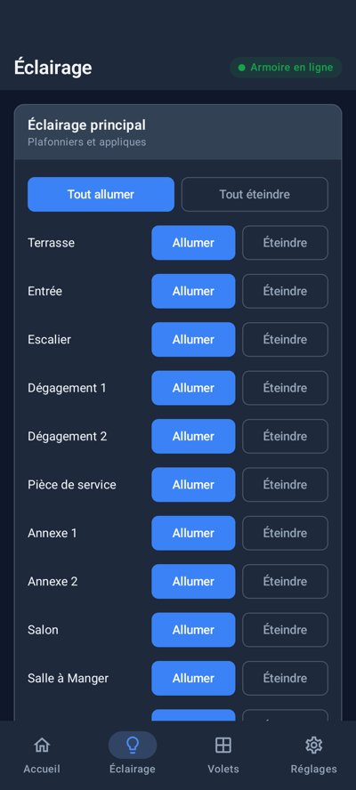
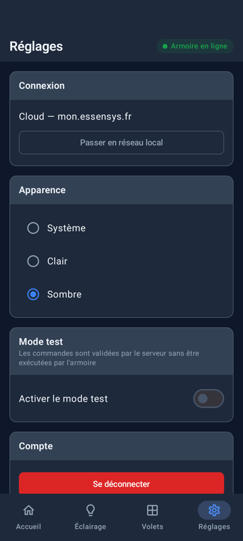

# Essensys Android

L'application Android officielle pour piloter une installation domotique Essensys. Elle reprend l'apparence et le fonctionnement du portail web, en **cloud** (`mon.essensys.fr`) ou directement sur le **réseau local** (gateway `mon.essensys.local`).

> **Version 2.0.0** (en cours, change OpenSpec `android-portal-refresh-2026-10-002`, ticket [essensys-feature-lifecycle#11](https://github.com/essensys-hub/essensys-feature-lifecycle/issues/11)). Refonte complète de la v1.0.0.

## Téléchargement

L'APK signé est publié dans les [releases GitHub](https://github.com/essensys-hub/essensys-android-phone-apps/releases) avec son empreinte SHA-256. On ne versionne plus d'APK dans le dépôt.

Certificat de signature officiel (SHA-256) : `A0:96:0E:61:21:9C:E1:0A:40:81:92:C0:7E:E3:9F:7C:B2:0B:41:DB:BD:7F:61:C7:B0:4A:7E:D5:22:4D:D2:B2`. Une release se publie en poussant un tag `android-vX.Y.Z` (workflow `release.yml`).

## Fonctionnalités (V1)

- **Connexion cloud** avec votre compte du portail (email et mot de passe), y compris le changement obligatoire d'un mot de passe temporaire.
- **Connexion réseau local** directement à la gateway, en HTTPS. Le certificat de la gateway est confirmé une seule fois, à la première connexion.
- **Liaison de l'armoire** : un compte sans armoire liée peut demander la liaison depuis l'application.
- **Éclairage** : par pièce, éclairage principal et indirect, « tout allumer » et « tout éteindre ».
- **Volets et stores** : par volet, par groupe ou tous, avec le temps de course configuré.
- **État de l'armoire** (en ligne ou hors ligne) et **dernière action** en cloud. Les commandes sont désactivées quand l'armoire est hors ligne.
- **Mode test** : le serveur valide les commandes sans que l'armoire les exécute.
- **Thème** Système, Clair ou Sombre, avec la charte du portail.

Le chauffage, les scénarios, le chauffe-eau, l'arrosage et l'alarme arrivent dans la prochaine version. En attendant, ils restent accessibles depuis le portail web.

## Aperçu

| Connexion | Accueil | Éclairage | Volets |
|---|---|---|---|
|  |  |  |  |

| Mot de passe temporaire | Liaison armoire | Éclairage (sombre) | Réglages (sombre) |
|---|---|---|---|
|  |  |  |  |

## Installation (client)

1. Si la v1.0.0 est installée, **désinstallez-la**. Ses identifiants étaient stockés en clair ; la v2 les efface de toute façon au premier lancement.
2. Téléchargez l'APK depuis la release et vérifiez son empreinte :
   ```bash
   shasum -a 256 essensys-android-2.0.0.apk
   ```
   Elle doit correspondre à l'empreinte publiée dans la release.
3. Ouvrez le fichier sur le téléphone et autorisez l'installation depuis cette source si Android le demande.
   - **Si Play Protect affiche « Application bloquée »** : c'est normal pour une app installée hors du Play Store et encore peu répandue. L'APK officiel est sain (signature vérifiable ci-dessus). **N'appuyez pas sur le bouton principal** (« OK » / « Fermer »), qui annule l'installation. Appuyez sur **Plus de détails**, puis sur **Installer quand même**. Voir [#9](https://github.com/essensys-hub/essensys-android-phone-apps/issues/9).
   - Sur Xiaomi (HyperOS/MIUI), un écran d'analyse de sécurité peut suivre : attendez la fin du compte à rebours, puis confirmez.
4. Lancez **Essensys** et choisissez le mode de connexion :
   - **Cloud** (recommandé) : connectez-vous avec le compte de votre portail `mon.essensys.fr`.
   - **Réseau local** : à utiliser chez vous, sur le Wi-Fi de l'installation. Adresse par défaut : `https://mon.essensys.local`. À la première connexion, l'application affiche l'**empreinte du certificat de la gateway**. Comparez-la avec celle que vous a transmise l'installateur, puis confirmez seulement si elle est identique.

## Développement

Kotlin, Jetpack Compose et OkHttp. Les versions sont regroupées dans `gradle/libs.versions.toml` : AGP 9.4, Kotlin 2.4, `compileSdk` 37, `targetSdk` 36, `minSdk` 26, Java 17.

### Prérequis

- JDK 21 (celui d'Android Studio convient), par exemple `export JAVA_HOME="/Applications/Android Studio.app/Contents/jbr/Contents/Home"`. Gradle 9.8 ne supporte pas encore les JDK plus récents.
- Android SDK avec la plateforme 37 et un émulateur (AVD `essensys-pixel`, API 36.1).

### Commandes

```bash
./gradlew assembleDebug lintDebug          # build + lint
./gradlew testDebugUnitTest                # tests unitaires (serveur simulé)
./gradlew connectedDebugAndroidTest        # tests instrumentés sur émulateur
```

Les tests ne pilotent **jamais** une armoire réelle : `NoArmoireInterceptor` fait échouer toute commande envoyée vers un hôte autre que le serveur simulé local. Les tests de non-régression portent l'identifiant `NR-android-<n>` et la référence de leur issue ([convention](https://github.com/essensys-hub/essensys-feature-lifecycle/blob/main/docs/feature-lifecycle/non-regression.md)). Dans Claude Code, `/checkup essensys-android-phone-apps` enchaîne build, lint, tests, non-régression, émulateur et captures.

### Architecture

| Paquet | Rôle |
|---|---|
| `data/http` | Client OkHttp, erreurs normalisées, intercepteurs (session, dry-run, no-armoire), TLS épinglé en LAN |
| `data/auth` | Connexion cloud (JWT) et LAN (cookie de session), changement de mot de passe, déconnexion |
| `data/control` | `IndexTable` (indices et masques du portail, verrouillés par les tests NR) et envoi des commandes |
| `data/session` | Session persistée (DataStore et clé Keystore), liaison, état de la gateway, dernière action |
| `ui` | Thème du portail, composants, écrans et ViewModels |

Gouvernance : chaque modification part d'un ticket du [GitHub Project Essensys](https://github.com/orgs/essensys-hub/projects/6), voir `essensys-feature-lifecycle/claude/GOVERNANCE.md`.
